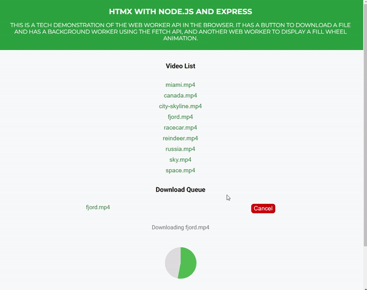

# HTMX File Download with Progress Wheel Animation

This project demonstrates the use of **Node.js**, **Express**, **HTMX**, and **Web Workers** to create a file download application with a visually engaging progress indicator. The app features a progress wheel animation that fills up as the download progresses, alongside a textual display of the percentage and file size.

---

## Features

- **Dynamic Progress Animation**: A visually engaging download progress wheel fills up based on the download progress.
- **File Size Display**: Shows the percentage of the file downloaded and the size in MB/KB/GB.
- **Web Workers**: Background file downloading and progress tracking without blocking the main thread.
- **Dynamic Video List**: Automatically generates download buttons for video files in the `/public/files` directory.
- **Responsive Design**: Styled with a modern green and grayish accent palette using **SASS**.
- **HTMX Integration**: Enables dynamic UI updates without full page reloads.

---

## Project Structure

```plaintext
├── public/
│   ├── css/
│   │   └── main.css           # Compiled CSS from SASS
│   ├── files/
│   │   └── placeholder-video.mp4 # Example video file for download
│   └── js/
│       ├── ui-worker-helper.js # Main script handling UI and worker messages
│       └── download-worker.js  # Web worker for downloading the file
├── views/
│   ├── index.html             # Main layout file
│   └── partials/
│       └── content.html       # Content template for rendering inner UI
├── index.js                     # Express server configuration
├── sass/
│   └── main.scss              # SASS file for styles
├── project-gif-screenshot.gif # Animated screenshot showcasing the project
└── README.md                  # Project documentation
```

---

## Requirements

- **Node.js** (v22 recommended)
- **npm** (Node Package Manager)

---

## Installation

1. Clone this repository:

   ```bash
   git clone https://github.com/TheAttentionSeeker5050/nodejs-htmx-web-worker-example
   cd nodejs-htmx-web-worker-example
   ```

2. Install dependencies:

   ```bash
   npm install
   ```

3. Compile SASS to CSS:

   ```bash
   npm run sass
   ```

4. Start the server:

   ```bash
   npm start
   ```

5. Open your browser and navigate to [http://localhost:3000](http://localhost:3000).

---

## How It Works

1. **UI Setup**: The main UI includes a list of videos, download buttons, a hidden progress wheel, and progress text.
2. **Dynamic Video List**: Videos stored in `/public/files` are dynamically listed on the page, allowing easy file management.
3. **File Download**:
   - On button click, the web worker fetches the file in chunks.
   - The worker tracks progress, total file size, and downloaded size.
4. **Progress Updates**:
   - The main thread updates the progress wheel and progress text every 500ms with data from the worker.
5. **Completion**:
   - Upon download completion, the wheel fills up entirely, and the file is saved locally.

---

## Scripts

- **`npm start`**: Starts the Express server.
- **`npm run sass`**: Compiles SASS files into CSS.

---

## Technologies Used

- **Node.js**: Backend server
- **Express**: Web framework
- **HTMX**: For dynamic UI updates
- **Web Workers**: For background processing
- **SASS**: For styling
- **EJS**: Template engine

---

## Screenshot


